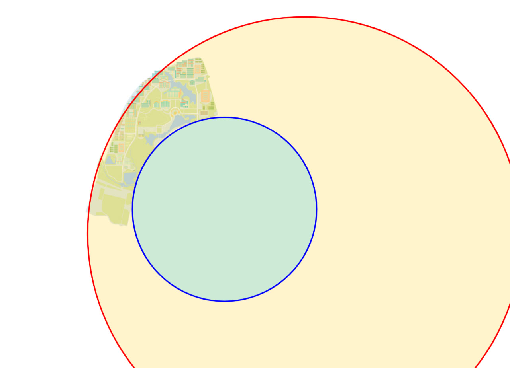

# NCUMap

mapping campus, mapping life!

## 关于定位的说明

定位数据来自高德 JS API，使用我个人的开发者 API Key，目前仅使用浏览器定位一种服务，日配额 50,000 次。获取到的位置数据为 gjc02 坐标，再调用 `/utils/gcj02towgs84.js` 中的函数转换为 wgs84 坐标，再调用 `convertCoordinates` 函数转换为校园地图坐标。

### 使用 wgs84 坐标 & 不使用高德地图组件的原因

尽量避免使用高德的服务，减少需要资金投入的可能性。

### 使用高德 JS API 定位服务的原因

- 提高精度
- [web 原生定位](https://developer.mozilla.org/zh-CN/docs/Web/API/Geolocation_API) 在某些情况下可能会调用 `googleapis.com` 提供的接口获取位置，然后因为不可说的原因报错。

### 判断是否在学校内的算法

在原有地图范围 256x256 的限制下，添加两个半径分别为 $r_1=338.903773758$ 和 $r_2=139.212193554$ 的正圆，圆心分别位于 $(358.719676797, 256 - 267.353227436)$ 和 $(237.606831329, 256 - 230.578642916)$ (坐标系原点位于左下角)，计算出当前位置在校园地图中的坐标后，使用两点间距离公式 $d=\sqrt{(x_1-x_2)^2+(y_1-y_2)^2}$ 分别计算该坐标与两个圆心的距离 $d_1$ 和 $d_2$，**只有在地图范围内且 $d_1<r_1, d_2>r_2$ 时判定为在校园内**。

## 为什么不使用建筑高亮功能

暂时不会写 [geoJSON](https://geojson.org/)。

## 地图切片说明

先将 Figma 中导出的 4x 大小 (分辨率为 8529×10891) 的 png 图片调整为方形，地图置于中间，再使用 [maptiles](https://github.com/jahed/maptiles) 工具在默认设置下切割，生成缩放范围为 0~6 的地图瓦片。

### 调整为方形的原因

使用 `maptiles` 工具切割非方形图片时边缘处的地图瓦片为非正方形，在渲染地图时会出现瓦片被拉伸的情况。

> `maptiles` 工具支持在参数中设置 `--square` 将图片调整为方形，但是实测中并未生效，原因未知。

## 代码中使用到的开源项目

- [mincu](https://mincu.vercel.app/)
- [Nuxt3](https://nuxt.com/)
- [Vuetify Nuxt Module](https://nuxt.vuetifyjs.com/)
- [Ant Design Vue](https://www.antdv.com/)
- [vue3-openlayers](https://vue3openlayers.netlify.app/)